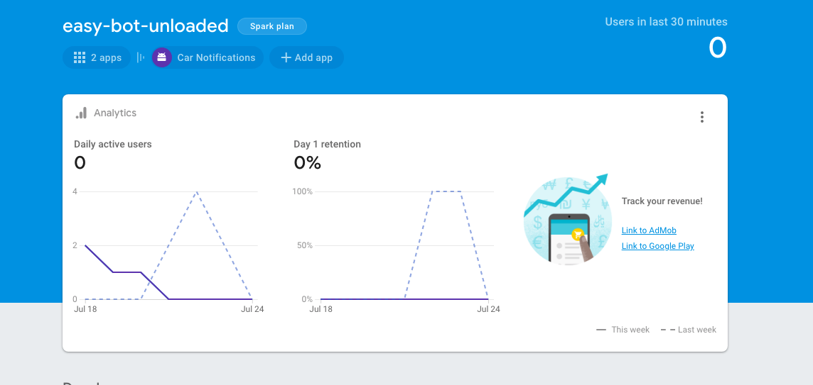
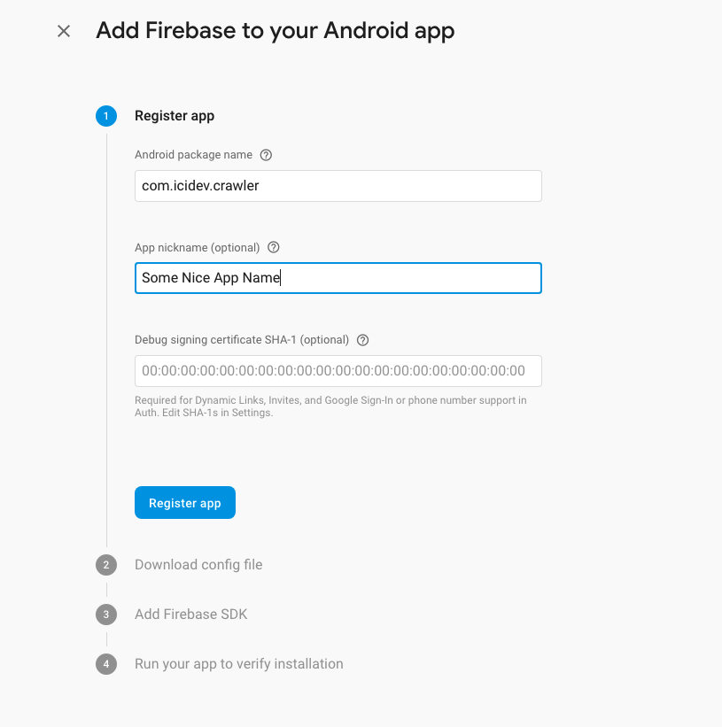
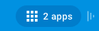
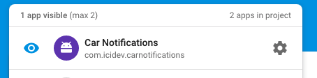

# Cars Crawl
Crawl cars from different websites all around!

This is the server side of the software, meaning it can crawl different automotive websites ( cars.bg for now ) based on the filtering options provided in `filterOptions.json`

To run the crawler you only need to run `npm run crawl && npm run filter`

First the bot will crawl the first 10 pages ( it can be adjusted in `crawl.js` ), then it will filter those results by initiating `filter.js` based on `filterOptions.json`.
The produced result will be in `offers.json`

In case you want to send FCM ( Firebase Cloud Messaging ) mobile notifications when the bot has found an offer, you will need to place your fcm Server Key in: `notification-key.json`

Here are the steps to generate your own Server Key from Firebase: 

Step 1: Go to your firebase project main dashboard page:

Step 2: Click on + Add App button and select the Android icon

Step 3: Fill in only the Android Package name and Nickname of your app

Step 4: Download the `google-services.json` file as you are going to need it later..

Step 5: Go to the dashboard again. See now you have 1 more app added to your project

Step 6: Click on the apps and click the gear icon of your newly created app

Step 7: In this page click on Cloud Messaging Tab

Step 8: Here, scroll down to the botton and click on Generate Server Key ( or whatever the button name is )

Step 9: Copy the generated server key and paste it in `notification-key.json` file

Now you can use `npm run schedule` which will trigger `node crawl && node filter && node getOffers` every 5 minutes:
- What this will do is crawl the web, filter the offers and send notifications to your recipients

For the client side of the software please refer to: https://github.com/hristo2612/car-notifications